# General Assembly WDI Project 3: A MERN Stack App

[Portfolio Link](https://munch-ga.herokuapp.com/)

Munch was the first MERN stack app I had built. It incorporated everything we had learned in the previous 8 weeks, including React, JavaScript and MongoDB.

---

## Brief

In 9 days and in groups of 4 we had to:

* **Build a full-stack application** by making your own backend and your own front-end
* **Use an Express API** to serve your data from a Mongo database
* **Consume your API with a separate front-end** built with React
* **Be a complete product** which most likely means multiple relationships and CRUD functionality for at least a couple of models
* Consume at least **one public API** to enhance your app
* **Implement thoughtful user stories/wireframes** that are significant enough to help you know which features are core MVP and which you can cut
* **Be deployed online** so it's publicly accessible.

## Technologies Used:

* JavaScript
* React
* HTML
* CSS
* Sass
* Node.js
* Mongoose
* Express
* Axios
* Filestack
* Yarn
* Bulma

## Approach Taken

In our team of 4 we created Munch, a social networking site for foodies, bringing together restaurant reviews and recipes all in one place. My part in the project included building the models in Node.js, building the friend request and pinned items functionality, implementing search, creating the initial seeds file and styling icons and buttons.

---

## Screenshot Walk-through

### Landing page for logged-out users prompting register/login.


### Register page that allows user to register their details.

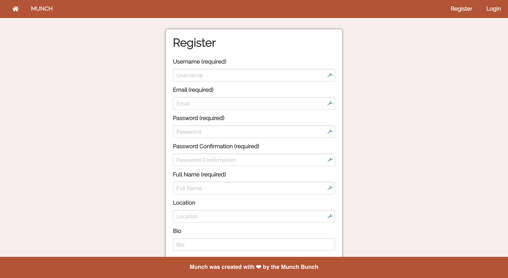

### Login page allows user to login.

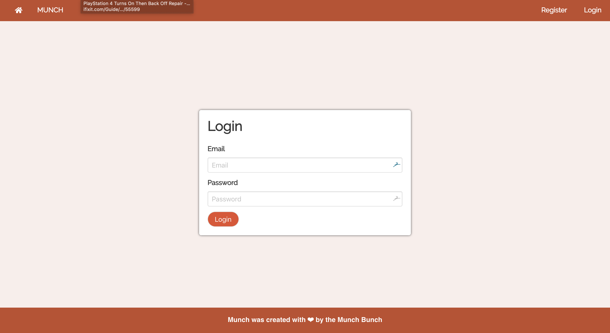

### The user's homescreen is a newsfeed which curates content specific to the user's category preferences and friends list.

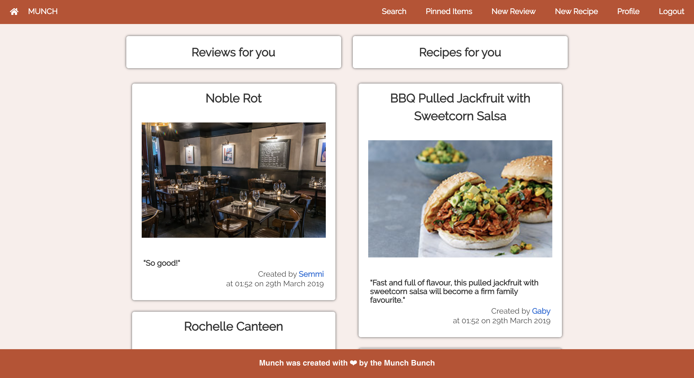

### The recipe page displays all the relevant info for the recipe, including the ability to pin the recipe, like the recipe, make a comment, and edit/delete if the user is the recipe owner.

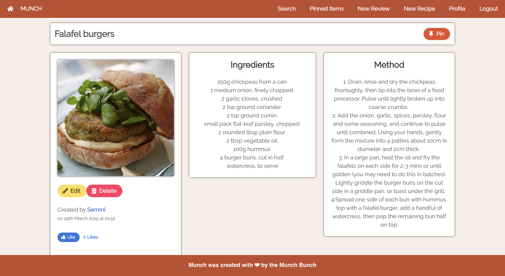

### The review page displays all the relevant info for the review, including the ability to pin the review, like the review, make a comment, and edit/delete if the user is the review owner.

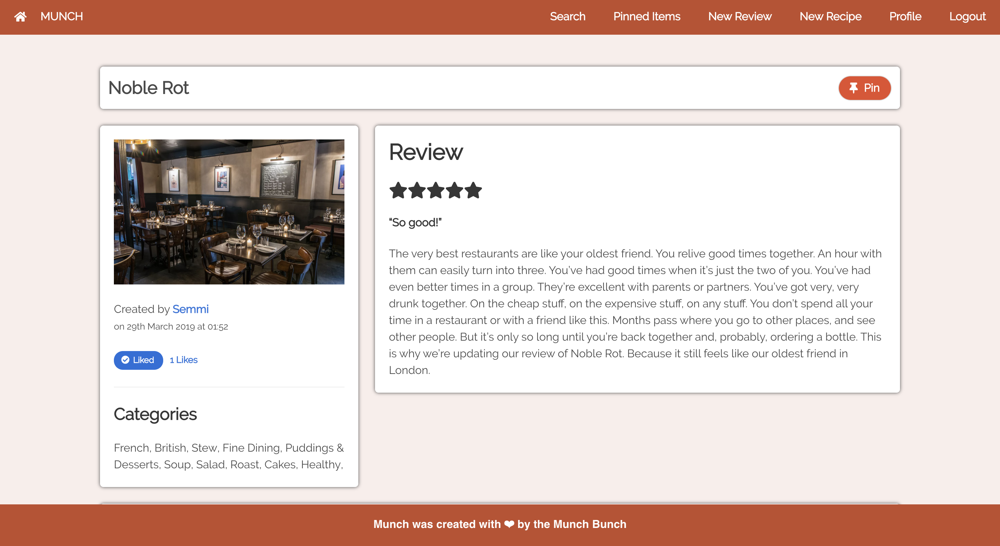

### The Profile page allows the user to browse their own details, find their recipes and reviews, see their friend list, and the option to edit their details.

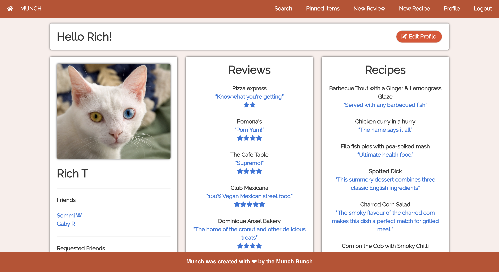

### Search allows the user to search the whole database for restaurants, recipes, ingredients and categories.

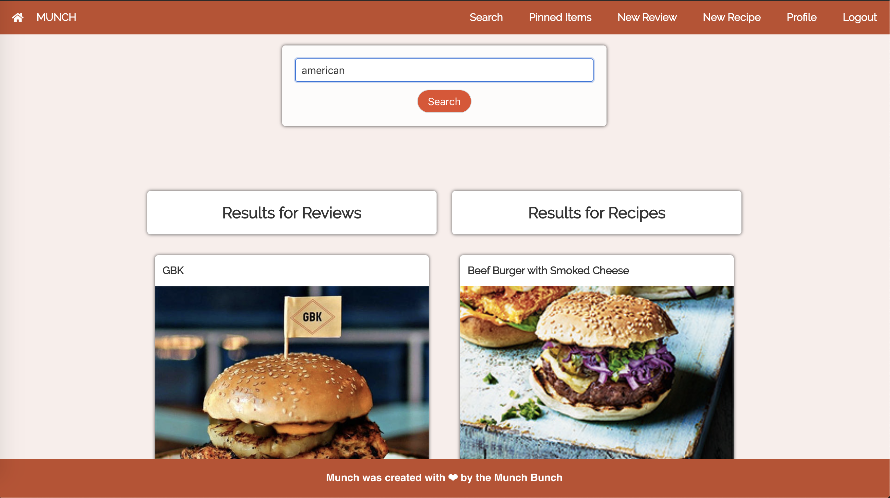

### The Pinned Items page allows users to see their pinned items all in one place.

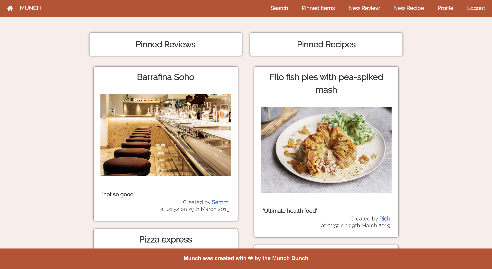

### The new review/recipe forms allow the user to create their own reviews and recipes.

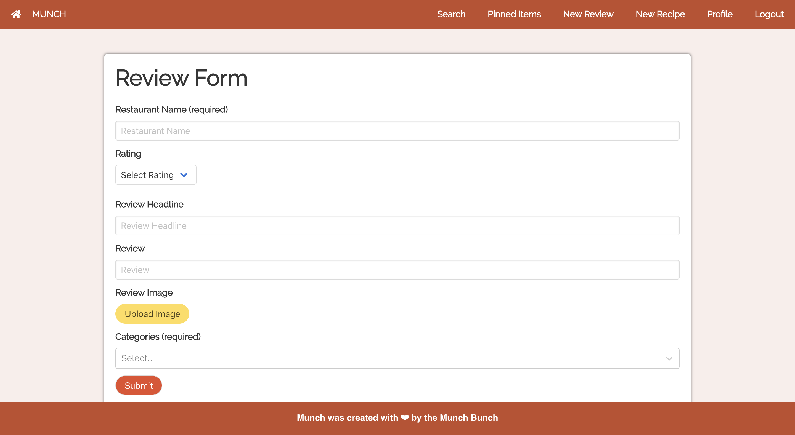

___

### Functionality

The functionality works much the same way as most popular social network sites. Users can:

* Register & login
* Post, edit and delete your own reviews and recipe
* Search posts
* Like other’s posts
* Friend other users
* Get a curated newsfeed based on your preferences and friends
* Pin your favourite reviews & recipes

### Process
When we realised there were very few apps that incorporated both restaurant reviews and recipes (apps tend to lean to one or the other), we realised we had our USP. Once we had settled on our concept, we got to work on the project.
1.  To work efficiently and effectively as a team, we used Trello to assign the various tasks amongst us. This was particularly useful when we were working remotely.
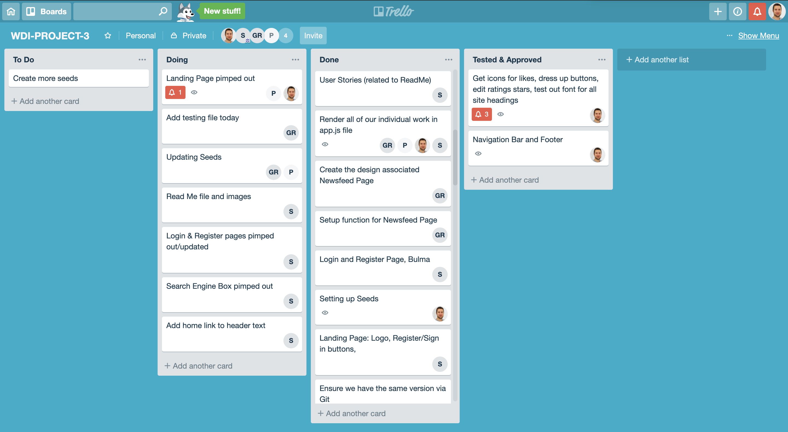
2.  In order to understand how our app would work at a fundamental level we needed to draft out models and routes in a visual manner.
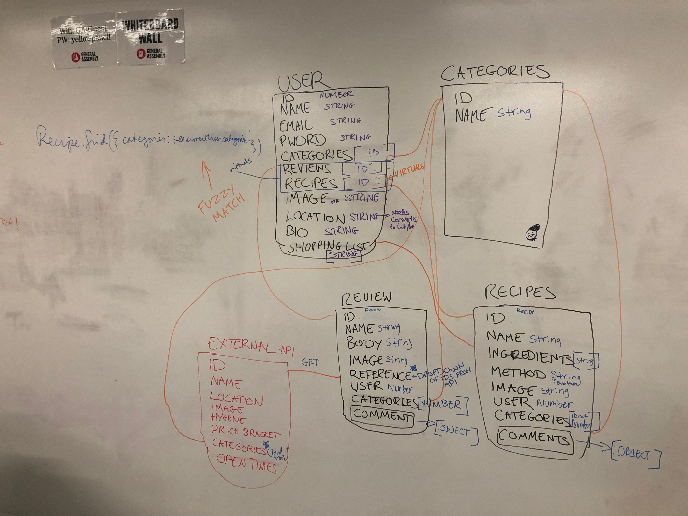
3.  We then created wireframes for the front end to visualise how our backend would interact with it.
4.  By day 2 we were happy with our respective wireframes, we began work on our backend: creating the models, controllers, and then routes, all in Node.js.
5.  By the end of day 4 we had tested the backend using Insomnia and we were happy with the functionality. We then started work on the frontend: creating the app.js file, then creating the various components that would make up the app, all in React.
6.  After day 6 we had reached an MVP level of completion, we began styling the app using the Bulma framework.

### Division of work

Other than Trello, as previously mentioned, other ways that we kept up to date on all our tasks and each other's progress was daily stand ups first thing in the morning. This was a great opportunity to keep everyone abreast of any issues, with the code or otherwise. We would often express our approach to our tasks and ask for any assistance from other team memebers. Some of the more challenging tasks were assigned to multiple team members so we could solve big issues quicker - this tactic was particularly applied to the backend, as we all wanted practice in setting up our own RESTful API. My contribution to the project included building the models in Node.js, building the friend request and pinned items functionality, implementing search, creating the initial seeds file and styling icons and buttons.


#### Featured piece of code 1

The User Schema was by far our most complicated model, as it had to contain the majority of datasets. It contained referenced models, as well as virtuals (for reviews and recipes) and a friends plugin. The friends plugin took quite a while to implement as the documentation wasn't as clear as I would have hoped. This was also my first experience with virtuals, which was quite challenging to understand at first.

``` JavaScript

const userSchema = new mongoose.Schema({
  username: { type: String, required: true, unique: true, trim: true },
  email: { type: String, required: true, unique: true },
  password: { type: String, required: true },
  name: { type: String, required: true },
  categories: [ {
    type: mongoose.Schema.ObjectId,
    ref: 'Category',
    required: true
  } ],
  image: { type: String },
  location: { type: String },
  bio: { type: String },
  pinnedRecipes: [ {
    type: mongoose.Schema.ObjectId,
    ref: 'Recipe'
  } ],
  pinnedReviews: [ {
    type: mongoose.Schema.ObjectId,
    ref: 'Review',
    required: true
  } ]
})

userSchema.plugin(friendsPlugin({ pathName: 'friends' }))

userSchema.virtual('reviews', {
  ref: 'Review',
  localField: '_id',
  foreignField: 'user'
})

```

### Styling

We used the CSS framework Bulma to style our app. This would take some of the heavy lifting out of creating things like navbars etc., so we could focus more on the functionality of the site. We customised the default Bulma settings as much as we could to differentiate itself from other Bulma products - which generally look quite similar. This involved customising the buttons to feature icons, changing the curvature of the cards, and some of the navbar configuration.

In future I would avoid using Bulma as we found it quite difficult to customise once we had applied its classes, and ended up being quite a time drain. In my next project I will try and use a different CSS framework like Materialise.

#### Featured piece of code 2

This is how we got our curated Newsfeed to work. It pulls in all the data from our API for recipes, reviews and user using an ```axios.all``` request. It then checks if the user is friends with the user who wrote the recipe/review - if yes, then then item will show. If not, it will check if the review shares any of the same categories as the user's preferences. It will finally check if the user is the author, and disregard the item if it's true.

``` JavaScript

componentDidMount() {
  axios.all([
    axios.get(`/api/user/${Auth.getPayload().sub}`),
    axios.get('/api/recipes'),
    axios.get('/api/reviews')
  ])
    .then(res => {
      const [ user, recipes, reviews ] = res
      const recipeFeed = recipes.data.filter(recipe => {
        return ((user.data.friends.some(friend => {
          return (recipe.user.id.includes(friend._id) && friend.status !== 'pending')
        })) || user.data.user.categories.some(category => {
          return recipe.categories.some(categoryObject => {
            return Object.values(categoryObject).includes(category._id)
          })
        }) && recipe.user.id !== Auth.getPayload().sub)
      })
      const reviewFeed = reviews.data.filter(review => {
        return ((user.data.friends.some(friend => {
          return (review.user.id.includes(friend._id) && friend.status !== 'pending')
        })) || user.data.user.categories.some(category => {
          return review.categories.some(categoryObject => {
            return Object.values(categoryObject).includes(category._id)
          })
        }) && review.user.id !== Auth.getPayload().sub)
      })
      this.setState({ recipeFeed, reviewFeed, user })
    })
}

```
___

### Wins and Blockers

One of the biggest blockers for this project was creating a substantial seeds file that incorporated promised. As some models relied on other models in order to be created, we had to establish multiple promises in the seeds file in order for the database to accept certain models. For instance, in order for a review to exist, it must first have a user and categories in order to create the review - so we would create the user and categories first and then promise them to the review seed.

``` JavaScript
     return Promise.all([
        Review.create([
          {
            'restaurantName': 'Noble Rot',
            'reviewHeadline': 'So good!',
            'reviewText': 'The very best restaurants are like your oldest friend.',
            'rating': 5,
            'image': 'https://infatuation.imgix.net/media/images/reviews/noble-rot-wine-bar/banners/1492493931.11.jpg?auto=format&h=840&w=1336',
            'user': users[getRandom(4)]._id,
            'categories': [categories[5]._id,categories[3]._id,categories[63]._id,categories[89]._id
          }
        )]
      )]
```

As for wins, I'm really pleased with how the backend works and allows the user to do everything a normal social media platform would. The friends request system and the pinned items are particularly slick, allowing users to customise their experience of the site easily and efficiently. The newsfeed also works really nicely, making it feel like a real service.
___

## Future Features

If we had more time essential future features we would like to add include:

* Adding an external API, such as Zomato, to display locations of restaurants.
* Ability to un-pin items and un-like reviews/recipes.
* A shopping list functionality so you could keep all the ingredients you needed for your next shop on your app.
* A simple cooking timer on the recipe pages to assist with timekeeping.
